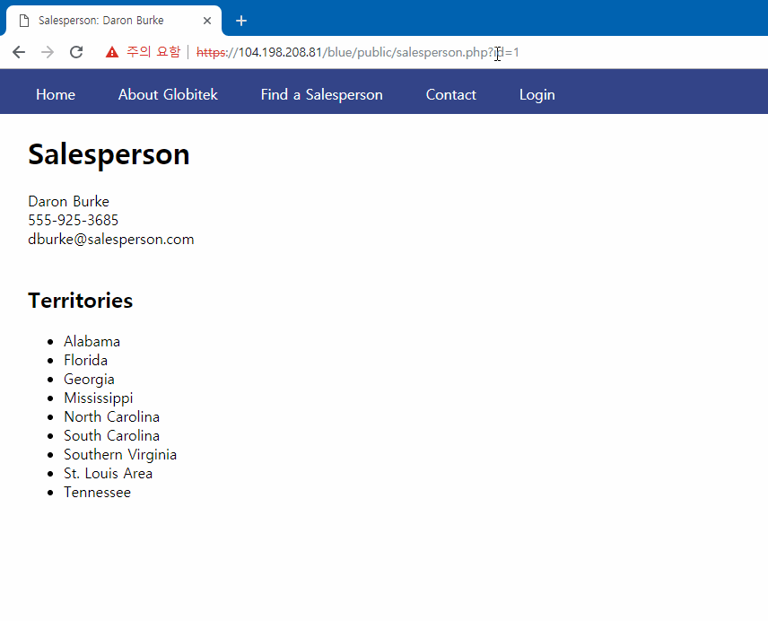
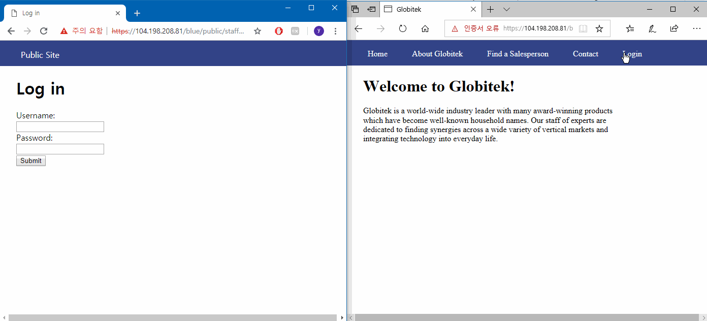
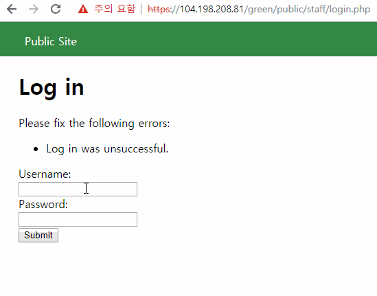
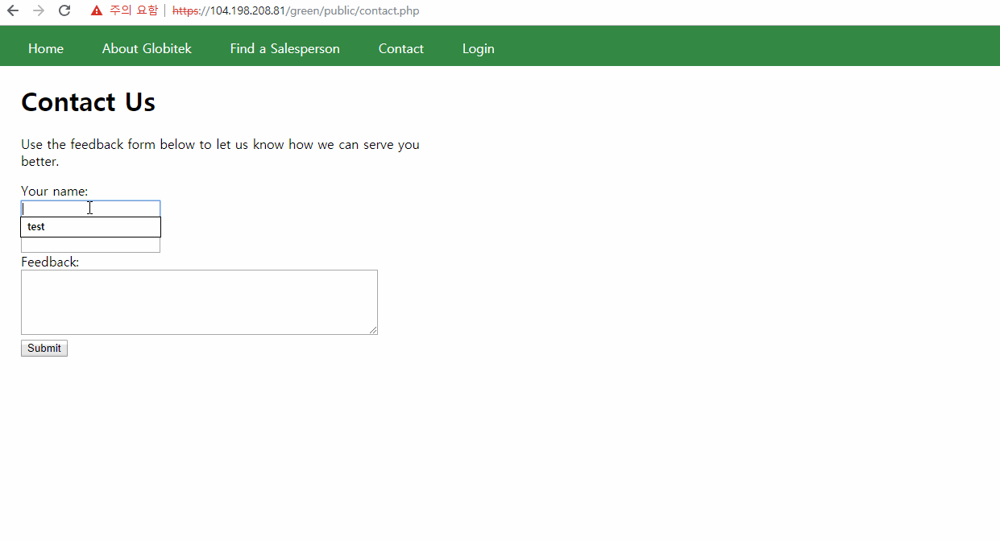
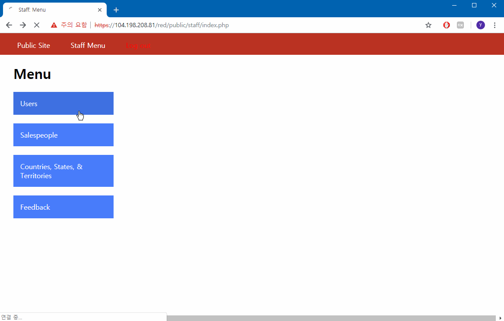

# Project 8 - Pentesting Live Targets

Time spent: **9** hours spent in total

> Objective: Identify vulnerabilities in three different versions of the Globitek website: blue, green, and red.

The six possible exploits are:
* Username Enumeration
* Insecure Direct Object Reference (IDOR)
* SQL Injection (SQLi)
* Cross-Site Scripting (XSS)
* Cross-Site Request Forgery (CSRF)
* Session Hijacking/Fixation

Each version of the site has been given two of the six vulnerabilities. (In other words, all six of the exploits should be assignable to one of the sites.)

## Blue

### Vulnerability #1: **SQL Injection (SQLi)**
  - Summary:
    - vulnerability found in https://104.198.208.81/blue/public/salesperson.php by passing in SQLi in the ```id``` parameter
  - GIF Walkthrough:
  - Steps to recreate:
    - send HTTP GET request to ```salesperson.php``` with ```' OR SLEEP(10)=0--'``` as the ```id``` parameter
    - the response will be delayed for 10 seconds as the database sleeps for 10 seconds which suggests that the SQLi was successful

### Vulnerability #2: **Session Hijacking/Fixation**
 - Summary:
    - vulnerability exploitable simply by changing the PHPSESSIONID
  - GIF Walkthrough:
  - Steps to recreate:
    - open the webpage in two different browsers and make sure the PHPSESSIONID is different and both are logged out
    - log in as admin from browser 1
    - using session id changer found in https://104.198.208.81/blue/public/hacktools/change_session_id.php set the PHPSESSIONID of browser 2 to match that of browser 1
    - admin page is now accessible from browser 2

## Green

### Vulnerability #1: **Username Enumeration**
  - Summary:
    - vulnerability found in https://104.198.208.81/blue/public/staff/login.php which returns differently formatted error message depending on the existence of username
  - GIF Walkthrough:
  - Steps to recreate:
    - try to log in with the known username ```jmonroe99``` which was provided
    - notice that the error message is in bold
    - now try to log in with some other username ```jmonroe```
    - notice that the error message is not in bold
  - Developer mistake:
    - when an existing username is entered the error message is shown in the following format:
    ```html
    <span class="failure">Log in was unsuccessful.</span>
    ```
    - when a non-existing username is entered the error message is shown in the following format:
    ```html
    <span class="failed">Log in was unsuccessful.</span>
    ```
    - the developer failed to standardize the ```class``` of the HTML ```span``` element
    
### Vulnerability #2: **Cross-Site Scripting (XSS)**
 - Summary:
    - vulnerability found in https://104.198.208.81/blue/public/contact.php in the ```Feedback``` field
    - script is executed when an admin views the feedback in https://104.198.208.81/blue/public/staff/feedback/index.php
  - GIF Walkthrough:
  - Steps to recreate:
    - submit a new feedback with ```<script>alert('yjcho321');</script>``` in the ```Feedback``` field
    - log in as admin and view feedbacks in https://104.198.208.81/blue/public/staff/feedback/index.php
    - notice that the script is executed with an alert message of ```yjcho321```
  
## Red

### Vulnerability #1: **Insecure Direct Object Reference (IDOR)**
  - Summary:
    - vulnerability found in https://104.198.208.81/red/public/salesperson.php by specifying the ```id``` parameter
  - GIF Walkthrough:
  - Steps to recreate:
    - send HTTP GET request to ```salesperson.php``` with the ```id``` parameter as 10, 11, 12, and 13
    - notice that the non-public profiles for the ```id``` value are accessible in the public webpage
    - repeat the process on the other two versions of the webpages, Green and Blue
    - notice that the profiles are now restricted and is redirected to ```/public/territories.php``` page
  - Developer mistake:
    - failed to check whether the profile corresponding to the requested ```id``` is public or not when accessed from the public webpage

### Vulnerability #2: **Cross-Site Request Forgery (CSRF)**
 - Summary:
    - vulnerability found in https://104.198.208.81/red/public/staff/users/edit.php with any user's ```id``` by removing the CSRF token from the form
  - GIF Walkthrough:
  - Steps to recreate:
    - open up the webpage and modify CSRF token value to an arbitrary value in the form
    - modify any other fields in the form as wished and submit the form
    - notice that the change is applied
    - now to exploit this vulnerability, create a new HTML document that sends a HTTP POST request to the page on loading
    - the following was used:
    ```html
    <html>
      <body onload="document.t1.submit()">
        <form action="https://104.198.208.81/red/public/staff/users/edit.php?id=2" method="POST" name="t1" target="empty">
          <input type="hidden" name="first_name" value="changedwithform" />
        </form>
        <iframe name="empty" style="width:0;height:0;border:0; border:none;"></iframe>
      </body>
    </html>
    ```
    - execute the HTML document on a browser with an active PHPSESSIONID of an admin
    - notice that the change is applied

## Assets

  - csrf.gif
  - idor.gif
  - session_hijacking.gif
  - sqli.gif
  - user_enumeration.gif
  - xss.gif

## Resources

GIFs created with [LiceCap](http://www.cockos.com/licecap/).

## License

    Copyright 2018 Yong Jun Cho

    Licensed under the Apache License, Version 2.0 (the "License");
    you may not use this file except in compliance with the License.
    You may obtain a copy of the License at

        http://www.apache.org/licenses/LICENSE-2.0

    Unless required by applicable law or agreed to in writing, software
    distributed under the License is distributed on an "AS IS" BASIS,
    WITHOUT WARRANTIES OR CONDITIONS OF ANY KIND, either express or implied.
    See the License for the specific language governing permissions and
    limitations under the License.
